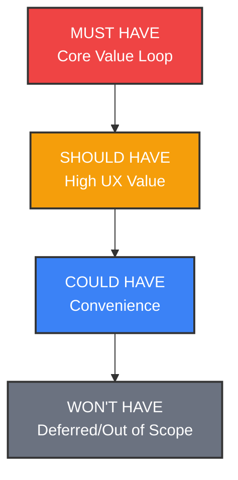

# MoSCoW Prioritization Framework

## ConnectIQ — Student Outreach Assistant

This document establishes the product prioritization framework for the **ConnectIQ** MVP (Minimum Viable Product) and subsequent releases using the **MoSCoW** methodology.

---

## 1. MoSCoW Summary Matrix

| Classification | Core Feature | Strategic Rationale |
| :--- | :--- | :--- |
| **Must Have** | • User Profile (Resume/Goal) • AI Outreach Generator • Copy-to-Clipboard Utility • Kanban Tracking Board • Follow-up Reminders (Badges) | Direct path to solving writing anxiety and contact organization. Essential to prove the core concept of an outreach assistant. |
| **Should Have** | • Recruiter Directory & Filter • Message Tone Toggles • Basic Analytics Dashboard • Rich Recruiter Notes | Crucial for user engagement, personalization flexibility, and showing progress to combat student networking discouragement. |
| **Could Have** | • Google Calendar Sync • Dark Mode UI • CSV Import/Export • Custom Kanban Columns | Adds high usability and integration convenience but does not block the user's core networking workflow. |
| **Won't Have** | • LinkedIn Auto-Messaging API • Automated PDF Resume Parser • Chrome Extension Scraper • Double-sided Recruiter Portal | Deferred due to severe technical risk (LinkedIn API policies), engineering scope overhead, or shift in core product focus. |

---

## 2. Detailed Classification & Rationale

### 2.1. Must Have (Required for Launch)
These features form the **Minimum Viable Product (MVP)**. Without them, the product is non-functional or fails to solve the student's core networking challenges.

* **User Profile Context (Resume & Target Goal Input)**
  * *Rationale:* The AI cannot write personalized messages without knowing the user's major, projects, background, and what they are looking for (e.g., software engineering internship).
* **AI Outreach Generator**
  * *Rationale:* This solves the primary pain point of "writing anxiety" and reduces message composition time from 30 minutes to seconds.
* **Copy-to-Clipboard Action**
  * *Rationale:* Since automated sending is restricted, a fast, frictionless copy utility is the critical link that lets students paste messages into LinkedIn or emails.
* **Kanban Tracking Board**
  * *Rationale:* Solves the disorganization pain point. Students must have a clear visual board to track who is in "Contacted," "In Discussion," or "Interviewing" stages.
* **Follow-up Reminders (Overdue Badges)**
  * *Rationale:* Networking requires multiple touchpoints. Visual alerts indicating which recruiters are due or overdue for a follow-up directly fix the "forgetting to follow up" problem.
* **Manual Recruiter Entry**
  * *Rationale:* Students must be able to log recruiters manually into their tracker by inputting a name, company, and contact details.

---

### 2.2. Should Have (High Priority, Post-MVP Phase 1)
These features add significant value and round out the core product experience, but the platform can still function without them in a bare-minimum release.

* **Basic Recruiter Search Directory**
  * *Rationale:* Helps solve the discovery problem. Having a pre-populated list of recruiters that users can filter by company, region, or vertical is highly valuable, though they could manually find them on LinkedIn and paste them in.
* **Outreach Tone Selector (Formal, Conversational, Direct)**
  * *Rationale:* Different companies have different cultures (e.g., Goldman Sachs vs. a seed-stage tech startup). Toggles for tone make the generated messages feel authentic and context-appropriate.
* **Basic Analytics Dashboard**
  * *Rationale:* Promotes user retention. Seeing progress metrics (total outreaches sent, response rates) helps students stay motivated during stressful job-hunting seasons.
* **Rich Recruiter Card Notes**
  * *Rationale:* Students need to log specific conversation details (e.g., "agreed to talk on Tuesday," "loves blockchain"). A simple notes area on each recruiter card provides vital context.

---

### 2.3. Could Have (Nice-to-Have, Phase 2)
These features are useful enhancements that improve quality of life and workflow integration but are not critical blockers.

* **Google Calendar Integration**
  * *Rationale:* Automatically adding interview dates or follow-up milestones to a user's Google Calendar is convenient, but the application's native reminder badges are sufficient for the MVP.
* **Dark Mode UI**
  * *Rationale:* A popular design choice that enhances visual appeal and accessibility, but does not affect the actual networking success rate.
* **CSV Import/Export**
  * *Rationale:* Allows users to export their data for external use or transition from existing spreadsheets, which is helpful but not essential for daily outreach.
* **Custom Kanban Columns**
  * *Rationale:* Letting users rename or create new pipeline stages is nice for customization, but the predefined stages (Wishlist, Contacted, In Discussion, Interviewing, Closed) cover 95% of use cases.

---

### 2.4. Won't Have (Out of Scope / Future Roadmap)
These features are deliberately excluded from early development cycles due to technical limitations, security policies, or excessive scope creep.

* **LinkedIn Automated Message Sender**
  * *Rationale:* **Severe Technical & Compliance Risk.** LinkedIn strictly bans third-party automation tools and scraper scripts. Writing automation software could lead to user accounts getting suspended. Copy-pasting is the safest approach.
* **Automated PDF Resume Parser**
  * *Rationale:* Parsing PDF files into semantic structured text has high engineering overhead. A simple text copy-paste box for resumes is a reliable, lightweight MVP alternative.
* **Chrome Extension Scraper**
  * *Rationale:* Building and maintaining a browser extension adds platform fragmentation and code duplication. Web application forms must be stabilized first.
* **Double-Sided Recruiter Portal**
  * *Rationale:* Creating a side of the app where recruiters can log in, post jobs, and find students shifts ConnectIQ from a **Student CRM Productivity tool** to a **Double-Sided Talent Marketplace**, which requires a completely different business model and distribution strategy.
