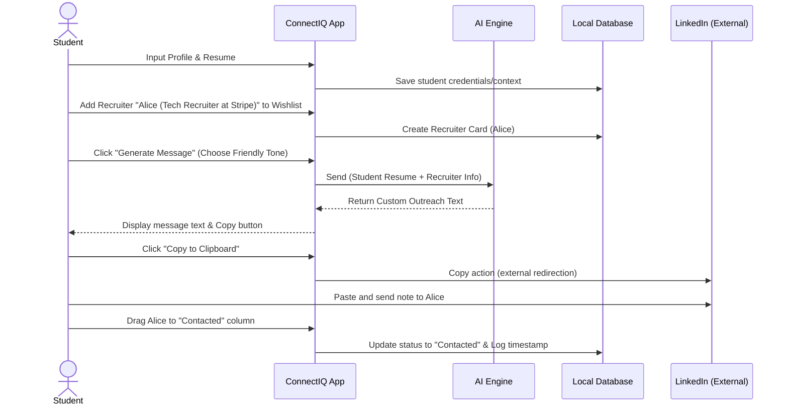

# User Flow & Journey Study

## ConnectIQ — Student Outreach Assistant

---

## 1. Case Study Overview
To design a high-impact, low-friction UX/UI for college students navigating recruitment outreach, we mapped the end-to-end lifecycle of a ConnectIQ user. This study breaks down the 8 core operational stages of the platform, details the persona journeys, defines error handling for edge cases, and provides a clear navigation map.

---

## 2. Step-by-Step User Flow

### 2.1. Sign Up & Authentication
* **User Goal:** Create a secure account with minimal effort to start using the platform immediately.
* **User Action:** Clicks "Sign Up," inputs email/password (or clicks "Continue with Google"), and accepts the Terms of Service.
* **System Response:** Creates a database entry, fires a verification email (if standard signup), and directs the user to the onboarding flow.
* **Pain Point Solved:** Eliminates long, daunting signup processes and provides instant access.

### 2.2. User Profile Setup (Onboarding)
* **User Goal:** Feed target goals and resume content into the system to prep the AI for outreach writing.
* **User Action:** Selects target industry (e.g., Tech, Finance), enters target job titles, and pastes/inputs resume text or key career highlights into a text area. Clicks "Save Profile."
* **System Response:** Stores target parameters and resume tokens, displays a progress bar showing setup completeness, and routes the user to the dashboard.
* **Pain Point Solved:** Prevents generic AI outputs by locking in context-aware personal details before the first outreach.

### 2.3. Recruiter Discovery
* **User Goal:** Identify relevant recruiter profiles targeting their desired roles and companies.
* **User Action:** Enters search criteria in the Recruiter Directory (e.g., Company: "Google", Location: "New York") or clicks "Add Custom" to input external LinkedIn profiles.
* **System Response:** Performs search query on the database, displays card results matching the parameters with recruiter names, titles, and companies.
* **Pain Point Solved:** Ends manual scavenger hunts on LinkedIn and lists high-intent recruiter targets in one dashboard.

### 2.4. Recruiter Selection
* **User Goal:** Move identified recruiters into their tracking pipeline to initiate networking.
* **User Action:** Clicks "Add to Pipeline" on a recruiter card and assigns them an initial status (default: "Wishlist").
* **System Response:** Spawns a tracking card on the Kanban Board under the designated column and updates the total tracked recruiters metric.
* **Pain Point Solved:** Avoids losing tabs or forgetting about a prospective contact they found on LinkedIn.

### 2.5. AI Message Generation
* **User Goal:** Draft a high-quality, personalized cold message that recruiters will answer.
* **User Action:** Clicks "Generate Message" on a recruiter’s card. Chooses tone (Formal, Friendly, Direct) and outreach type (LinkedIn Connection Request, Email/InMail). Clicks "Generate."
* **System Response:** Calls LLM using the user's saved resume and target goals merged with the recruiter's name, role, and company. Renders the custom draft on-screen and enables the "Copy to Clipboard" button.
* **Pain Point Solved:** Cures "blank screen syndrome" (writing anxiety) and reduces drafting time from 30 minutes to seconds.

### 2.6. Outreach Tracking (Kanban Board)
* **User Goal:** Keep track of who they contacted and see progress through the recruitment funnel.
* **User Action:** Copies the AI message, clicks the "Go to LinkedIn" link, sends the message externally, and drags the recruiter card from "Wishlist" to "Contacted" on the Kanban board.
* **System Response:** Moves the card visually, registers the timestamp of contact, and adds a transaction entry to the database.
* **Pain Point Solved:** Replaces messy, static spreadsheets with a dynamic, visual CRM.

### 2.7. Follow-up Management
* **User Goal:** Remember to follow up with non-responsive or conversational contacts at the right intervals.
* **User Action:** On the recruiter card, clicks "Schedule Follow-up" and picks a date (e.g., in 5 days). 
* **System Response:** Sets a database reminder. When the date matches the current local date, the system marks the card as "Due" with a prominent red badge indicator on the dashboard.
* **Pain Point Solved:** Stops warm leads from going cold due to student forgetfulness.

### 2.8. Analytics Dashboard
* **User Goal:** Assess networking efficiency and keep motivation high.
* **User Action:** Navigates to the Dashboard tab.
* **System Response:** Renders aggregated metrics: Total Sent, Response Rate (percentage of contacts that moved past "Contacted"), and weekly outreach bar charts.
* **Pain Point Solved:** Combats job-hunting discouragement by visualizing concrete networking efforts.

---

## 3. End-to-End User Journey

```
[Onboarding]
  User Signs Up -> Pastes Resume & Targets -> System Saves Profile Configuration
        |
[Outreach Planning]
  User Searches/Adds Recruiters -> Adds cards to "Wishlist" stage
        |
[Execution]
  User generates AI message -> Copies message -> Sends on LinkedIn -> Drags card to "Contacted"
        |
[Pipeline Management]
  User sets follow-up date -> Dashboard alerts user -> User follows up -> Drags card to "In Discussion"
        |
[Success Metric]
  User reviews Analytics -> Sees response rate improvement -> Secures interview
```

---

## 4. Happy Path Sequence



---

## 5. Edge Cases & Error States

| Edge Case / Error | Risk | System Response / Mitigating Action |
| :--- | :--- | :--- |
| **Missing Resume on AI Generation** | AI produces hallucinated or highly generic templates. | Alert modal pops up: *"Please add details to your Profile first to unlock hyper-personalized messages."* redirects to Profile page. |
| **Outreach Message Over 300 Characters** | LinkedIn connection request notes are capped. If the generated AI message is too long, it will be truncated when sending. | The AI generator counts characters. If "Connection Request" is selected, the LLM prompt forces strict constraint, and a counter UI shows `285/300` in green (or turns red if over limit). |
| **Duplicate Recruiter Entry** | User adds the same recruiter LinkedIn profile twice. | System intercepts the add query, triggers toast alert: *"Alice (Stripe) is already in your Pipeline under 'Contacted' column."* |
| **Follow-up Date in Past** | User accidentally schedules a reminder for yesterday or a past date. | Datepicker UI disables past dates; if manual entry bypasses this, system validates and forces date to default (+3 days from today). |
| **API/LLM Downtime** | Student cannot generate messages during high traffic or server downtime. | Renders fallback templates based on goal (Job Inquiry, Informational interview) with placeholders: `[Company]`, `[Your major]`, etc., plus warning: *"Generating custom AI drafts is currently slow. Here is a baseline template."* |

---

## 6. Navigation Map (Information Architecture)

```
                       [ LOGIN / SIGN UP ]
                                |
                        [ USER PROFILE ] (First-time onboarding)
                                |
               +----------------+----------------+
               |                                 |
         [ DASHBOARD ]                     [ TRACKER ] (Kanban)
         - Summary Metrics                 - Stage Columns
         - Follow-up Alerts Badge          - Drag & Drop Interface
         - Weekly Progress Graph           - Recruiter Profile Modal
               |                                 |
       [ FIND RECRUITERS ]                 [ AI GENERATOR ]
       - Directory Filters                 - Message Inputs (Tone/Goal)
       - "Add to Tracker" Action           - Message Editor & Copy UI
```
